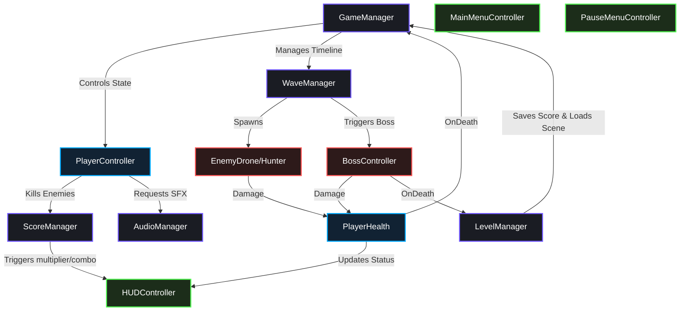

# 🌌 Galaxy Defender

🇻🇳 *Dự án Game bắn súng không gian 2D Retro Arcade hoàn chỉnh được thiết kế và phát triển bằng Unity 2022.3 LTS. Tài liệu này mô tả chi tiết từ cơ chế gameplay, kiến trúc phần mềm, thông số kỹ thuật đến hướng dẫn build game và quy trình làm việc nhóm.*

---

[](https://unity.com/)
[](https://microsoft.com/)
[](https://github.com/)
[](LICENSE)

---

## 📖 Table of Contents
1. [🎮 Game Controls](#-game-controls)
2. [🛸 Deep Dive: Core Gameplay Systems](#-deep-dive-core-gameplay-systems)
3. [🧬 Software Architecture & Design Patterns](#-software-architecture--design-patterns)
4. [📂 Project Directory Mapping](#-project-directory-mapping)
5. [📜 Comprehensive Script Catalogue](#-comprehensive-script-catalogue)
6. [⚙️ Technical Specifications & Game Balancing](#️-technical-specifications--game-balancing)
7. [🛠️ Installation, Setup & Build Guide](#️-installation-setup--build-guide)
8. [👥 Team Collaboration & Git Guidelines](#-team-collaboration--git-guidelines)

---

## 🎮 Game Controls

| Key / Input | Action | Technical Realization |
| :--- | :--- | :--- |
| `W` / `A` / `S` / `D` or `Arrow Keys` | **8-Way Movement** | Applied via `Rigidbody2D.MovePosition` in `FixedUpdate` (normalized to prevent diagonal speed boosts). |
| `Left Shift` | **Tactical Dash** | 3× speed burst for `0.15s`. Grants invincibility frames (i-frames) and shields the player from damage. Cooldown: `1.5s`. |
| `Spacebar` (Hold) | **Primary Weapon Fire** | Spawns bullets from nose tip at a rate of 1 bullet per `0.05s` (using Object Pooling). |
| `Escape` | **Pause / Resume** | Freezes the game scale (`Time.timeScale = 0`), opening the Pause panel interface. |

---

## 🛸 Deep Dive: Core Gameplay Systems

### 1. Player Ship Configurations & Upgrades
* **Dynamic Ship Selection**: On startup, the game randomly selects one of 5 preset ship designs (`ShipConfig`), configuring the matching custom player and bullet sprites:
  * **Default**
  * **Iron Vanguard**
  * **Nova Prism**
  * **Shadow Wraith**
  * **Star Swift**
* **Procedural Weapon Upgrades**: The player's weapon system starts firing 3 spread bullets. Collecting power-ups upgrades this systematically by multiplying bullet counts by 3 (from 3 ➔ 9 ➔ 27 bullets).
* **Dynamic Screen Clamp**: Player movement is restricted to the lower half of the camera viewport (clamped between the bottom 10% and bottom 50% lines) to avoid collisions with spawning waves.
* **Thruster & Trail Visuals**: Features custom visual effects:
  * **Dynamic Thruster Scaling**: The thruster flame sprite stretches (up to `1.6x` scale) when moving forward/upward, flickering with neon colors.
  * **HSV Rainbow Trail**: Generates a custom `TrailRenderer` cycling through colors using the HSV spectrum.

### 2. Physics-Based Health & Death Mechanics
* **HP and Shield Values**: The player features a high-fidelity pool of `1,000,000 Max HP` and `1,000,000 Max Shield`. The shield acts as a buffer, absorbing incoming damage first.
* **Knockback Nudge**: Taking damage triggers a physical knockback direction away from the impact point, executed via a kinematic Rigidbody2D coroutine over `0.1s`.
* **Slow-Motion Respawn**: When a life is lost, the game enters a dramatic slow-motion sequence (`Time.timeScale = 0.3f`) for `0.8s` before respawning the ship at the bottom center.

### 3. Procedural Space Weather Controller
The game features procedural weather effects managed by `SpaceWeatherController.cs` that scale with level progression:
* **Level 1 (Earth Orbit)**: Gentle Cosmic Dust storm (Cyan/White shimmering dust particles drifting with minor wind).
* **Level 2 (Asteroid Field)**: Solar Wind & Radiation Flares (Amber/Orange sparks with horizontal sine wobbles). Triggers periodic screen-space orange radiation pulses.
* **Level 3 (Deep Space)**: Hypernova Comet Storm (Neon teal comet trails traveling at 3.5× speed with strong diagonal winds).
* *Performance Optimization*: All weather particles are generated **procedurally at runtime** by building a soft-gradient glow texture dynamically via `CreateGlowSprite()`, preventing texture asset load times.

### 4. Dynamic & Destructible Level Grid
Levels are generated dynamically with vertical parallax layers and tilemap matrices:
* **Parallax Scrolling**: Scrolls layers independent of each other (DeepSpace, Decor, Asteroids, Hazard, StationWalls) to simulate organic depth.
* **Organic Obstacles (Asteroids)**: Asteroids spawn with randomized scaling (between 50% and 90% size) and random 2D rotation angles (0° to 360°) to make boundaries feel organic. Colliding with them deals 50,000 damage.
* **Dynamic Station Bricks**: Levels 2 and 3 spawn temporary station brick obstacles that scroll downward. They blinks to warn the player before expiring after 6 seconds:
  * **Helper Bricks (Green)**: Restore 50,000 HP and Shield on collision.
  * **Hazard Bricks (Red)**: Deal 20,000 damage to the player.
  * *Rendering Safety*: Bricks verify their sorting layer against the player's layer; if the player is faded or on a different layer, collisions are ignored.

### 5. Multi-Phase Boss System
Spawning in Level 3 Wave 2, the Boss ship operates on health-threshold states:
* **Phase 1 (100% - 66% HP)**: Moves slow, firing straight projectiles.
* **Phase 2 (66% - 33% HP)**: Starts moving in a horizontal sine wave and increases fire rate.
* **Phase 3 (33% - 0% HP)**: Rapid sine movement, fires a wide 3-bullet spread shot (±15°), and spawns exactly 2 Drone helpers.
* *Safety Transition*: When HP reaches 0, a boolean flag `isDying` locks the boss's hitbox to prevent double-kills and plays a large particle explosion before loading the Victory scene.

---

## 🧬 Software Architecture & Design Patterns

The codebase is built on SOLID principles to keep systems highly decoupled:

* **Singleton Pattern**: Core controllers (`GameManager`, `WaveManager`, `ScoreManager`, `LevelManager`, `AudioManager`) utilize the Singleton pattern, ensuring centralized access points.
* **Object Pooling**: Managed through `ObjectPool.cs`, bullets and impact effects are cached inside containers on Awake. If the max capacity is reached, the pool automatically recycles the oldest active bullet.
* **ScriptableObject Configurations**: Level wave lists and enemy stats are serialized using ScriptableObjects (`WaveData`), making wave patterns easily editable in the Inspector.
* **Event-Driven UI**: HighScore and HUD elements are updated instantly through `UnityEvents` (`OnHPChanged`, `OnShieldChanged`, `OnScoreChanged`), avoiding expensive `Update()` calls.

### Architectural Interaction Diagram



---

## 📂 Project Directory Mapping

```
Assets/
├── Animations/             # Contains clips, sprite sheet frames, and Animator Controllers
├── Audio/                  # Holds background tracks and event-triggered SFX files
│   ├── BGM/                # Loopable chiptune tracks (Streaming load)
│   └── SFX/                # Collision, shoot, and UI sounds (Decompress on Load)
├── Fonts/                  # TextMeshPro fonts (PressStart2P) and SDF assets
├── Prefabs/                # Instantiated game templates (Player, Drone, Hunter, Boss)
├── Resources/              # Dynamic asset files (TileSetData, PanelSettings)
├── Scenes/                 # The main executable scenes (MainMenu, Levels, GameOver)
├── Scripts/                # C# Scripts organized by gameplay responsibilities
│   ├── Player/             # Player controller inputs and health states
│   ├── Enemy/              # Enemy behavior scripts, boss controllers, and obstacles
│   ├── Managers/           # Singletons overseeing global states, waves, and audio
│   ├── Systems/            # Core physics, object pools, weather, and tile loaders
│   └── UI/                 # HUD layout controllers and menu animations
├── Settings/               # URP settings and configuration scripts
├── Sprites/                # Sprite assets sliced to Point-filtered grid sheets
└── TilePalettes/           # Sliced tile palettes for painting scene grids
```

---

## 📜 Comprehensive Script Catalogue

Below is a complete description of the scripts driving the systems:

### 🛸 Player Components
* [PlayerController.cs](file:///d:/Coder-Program/Code_Unity%20Game/PRU213_Project_Su26Semester_GalaxyDefender/Assets/Scripts/Player/PlayerController.cs) - Manages 8-way movement input, boundaries, weapon tiers, screen space clamps, and thruster flickers.
* [PlayerHealth.cs](file:///d:/Coder-Program/Code_Unity%20Game/PRU213_Project_Su26Semester_GalaxyDefender/Assets/Scripts/Player/PlayerHealth.cs) - Tracks HP/Shield values, damage absorption, knockbacks, and the slow-motion respawn routine.

### 👾 Enemy & Obstacle Behaviors
* [BossController.cs](file:///d:/Coder-Program/Code_Unity%20Game/PRU213_Project_Su26Semester_GalaxyDefender/Assets/Scripts/Enemy/BossController.cs) - Implements the Level 3 boss's 3 phases, pathing, and spread shoot styles.
* [EnemyDrone.cs](file:///d:/Coder-Program/Code_Unity%20Game/PRU213_Project_Su26Semester_GalaxyDefender/Assets/Scripts/Enemy/EnemyDrone.cs) - Drives Level 1 drone behaviors (vertical descent and firing intervals).
* [EnemyHunter.cs](file:///d:/Coder-Program/Code_Unity%20Game/PRU213_Project_Su26Semester_GalaxyDefender/Assets/Scripts/Enemy/EnemyHunter.cs) - Drives Level 2 hunter behaviors (X-axis player tracking and target fire).
* [EnemyHealth.cs](file:///d:/Coder-Program/Code_Unity%20Game/PRU213_Project_Su26Semester_GalaxyDefender/Assets/Scripts/Enemy/EnemyHealth.cs) - Monitors health, damage flashes, scoring triggers, and power-up drop drops.
* [ObstacleMine.cs](file:///d:/Coder-Program/Code_Unity%20Game/PRU213_Project_Su26Semester_GalaxyDefender/Assets/Scripts/Enemy/ObstacleMine.cs) - Handles passive space mines that explode on proximity or bullet contact.

### 💼 Manager Singletons
* [GameManager.cs](file:///d:/Coder-Program/Code_Unity%20Game/PRU213_Project_Su26Semester_GalaxyDefender/Assets/Scripts/Managers/GameManager.cs) - Governs the central Finite State Machine ( FSM ) (Playing, Paused, GameOver, Victory).
* [WaveManager.cs](file:///d:/Coder-Program/Code_Unity%20Game/PRU213_Project_Su26Semester_GalaxyDefender/Assets/Scripts/Managers/WaveManager.cs) - Polls active enemy counts, handles spawn positions, and transitions waves.
* [LevelManager.cs](file:///d:/Coder-Program/Code_Unity%20Game/PRU213_Project_Su26Semester_GalaxyDefender/Assets/Scripts/Managers/LevelManager.cs) - Directs scene transitions and triggers Victory conditions.
* [AudioManager.cs](file:///d:/Coder-Program/Code_Unity%20Game/PRU213_Project_Su26Semester_GalaxyDefender/Assets/Scripts/Managers/AudioManager.cs) - Controls background tracks (with crossfades) and triggers event-based SFX.
* [SaveManager.cs](file:///d:/Coder-Program/Code_Unity%20Game/PRU213_Project_Su26Semester_GalaxyDefender/Assets/Scripts/Managers/SaveManager.cs) - Saves and loads player score records and graphics/volume preferences using `PlayerPrefs`.
* [ScoreManager.cs](file:///d:/Coder-Program/Code_Unity%20Game/PRU213_Project_Su26Semester_GalaxyDefender/Assets/Scripts/Managers/ScoreManager.cs) - Tracks score, combos, and multipliers.

### ⚙️ Core Systems
* [ObjectPool.cs](file:///d:/Coder-Program/Code_Unity%20Game/PRU213_Project_Su26Semester_GalaxyDefender/Assets/Scripts/Systems/ObjectPool.cs) - Recycles project projectiles and particles to maintain 0 GC allocation.
* [SpaceWeatherController.cs](file:///d:/Coder-Program/Code_Unity%20Game/PRU213_Project_Su26Semester_GalaxyDefender/Assets/Scripts/Systems/SpaceWeatherController.cs) - Generates procedural glow sprites and handles level weather particles.
* [LevelTilemapSpawner.cs](file:///d:/Coder-Program/Code_Unity%20Game/PRU213_Project_Su26Semester_GalaxyDefender/Assets/Scripts/Systems/LevelTilemapSpawner.cs) - Spawns vertical tilemap layers, parallax loops, and dynamic station walls.
* [StationBrickObject.cs](file:///d:/Coder-Program/Code_Unity%20Game/PRU213_Project_Su26Semester_GalaxyDefender/Assets/Scripts/Systems/StationBrickObject.cs) - Controls temporary station wall bricks (blinking warning, layer check, and damage/heal effects).
* [RuntimeSpriteFixer.cs](file:///d:/Coder-Program/Code_Unity%20Game/PRU213_Project_Su26Semester_GalaxyDefender/Assets/Scripts/Systems/RuntimeSpriteFixer.cs) - Standardizes import and rendering settings of newly imported pixel sprites.

### 🖥️ User Interface Controllers
* [HUDController.cs](file:///d:/Coder-Program/Code_Unity%20Game/PRU213_Project_Su26Semester_GalaxyDefender/Assets/Scripts/UI/HUDController.cs) - Displays real-time HP/Shield sliders, scores, and active multiplier values.
* [BossHUDController.cs](file:///d:/Coder-Program/Code_Unity%20Game/PRU213_Project_Su26Semester_GalaxyDefender/Assets/Scripts/UI/BossHUDController.cs) - Controls Warning banners and the boss health bar.
* [MainMenuController.cs](file:///d:/Coder-Program/Code_Unity%20Game/PRU213_Project_Su26Semester_GalaxyDefender/Assets/Scripts/UI/MainMenuController.cs) - Handles menu button interactions and reads score history profiles.
* [OptionsController.cs](file:///d:/Coder-Program/Code_Unity%20Game/PRU213_Project_Su26Semester_GalaxyDefender/Assets/Scripts/UI/OptionsController.cs) - Links UI sliders to Unity `AudioMixer` Decibel levels.

---

## ⚙️ Technical Specifications & Game Balancing

### Player Balancing Settings
* **Base Movement Speed**: `12 units/second`
* **Tactical Dash Speed**: `18 units/second` for `0.15 seconds`
* **Starting Lives**: `3`
* **Starting Bullet Spawn Count**: `3` spread lasers

### Enemy Balancing Matrix

| Enemy Type | Max HP | Speed | Shooting Pattern | Score Value |
| :--- | :---: | :---: | :--- | :---: |
| **Drone** | 20 | 2.0 u/s | Single straight shot (2s interval) | 100 |
| **Hunter** | 40 | 3.5 u/s | Horizontal tracking shot (1.5s interval) | 200 |
| **Boss Phase 1** | 300 | 1.0 u/s | Direct single shot (1.0s interval) | - |
| **Boss Phase 2** | 200 | 1.5 u/s | Fast straight bullet barrage (0.7s interval) | - |
| **Boss Phase 3** | 100 | 2.0 u/s | Wide 3-bullet spread shot (0.4s interval) | 1000 |

### Score Combo Increments
* **Drone Destroyed**: `+100 Points`
* **Hunter Destroyed**: `+200 Points`
* **Boss Defeated**: `+1000 Points`
* **Power-up collected**: `+50 Points`
* **Streak Multipliers**: 
  * `5 Kills` without taking damage ➔ **Combo x2** score multiplier.
  * `10 Kills` without taking damage ➔ **Combo x3** score multiplier.
  * *Note*: Taking damage resets the combo counter to 0.

---

## 🛠️ Installation, Setup & Build Guide

### Editor Loading
1. Open **Unity Hub** and click **Add** ➔ **Add project from disk**.
2. Select the `PRU213_Project_Su26Semester_GalaxyDefender` folder.
3. Open the project using **Unity 2022.3 LTS**.
4. Once loaded, open [MainMenu.unity](file:///d:/Coder-Program/Code_Unity%20Game/PRU213_Project_Su26Semester_GalaxyDefender/Assets/Scenes/MainMenu.unity) to test run from the editor.

### Scene Hierarchy Ordering
To build the game successfully, ensure the build order under **File ➔ Build Settings...** is configured as:
1. `MainMenu.unity` (Index 0)
2. `Level1.unity` (Index 1)
3. `Level2.unity` (Index 2)
4. `Level3_Boss.unity` (Index 3)
5. `GameOver.unity` (Index 4)

### Building Executable
* **Target OS**: Windows (64-bit)
* **API Compatibility Level**: .NET Standard 2.1
* Click **Build**, create an output folder (e.g. `Builds/`), and open `GalaxyDefender.exe`.

---

## 👥 Team Collaboration & Git Guidelines

To maintain code integrity and avoid Unity YAML conflicts, follow these 3 golden rules:

1. **Lock Scenes (Rule 1)**: Do not edit scene files (`.unity`) simultaneously. Work on localized **Prefabs** (`.prefab`) instead, and let scenes auto-update.
2. **Commit Meta Files (Rule 2)**: Every script or sprite asset has a matching `.meta` GUID file. Never ignore or split meta file commits, otherwise game linkages will break (producing pink missing textures).
3. **Branching Protocol**:
   * Branch Schema: `[role]/[feature-name]` (e.g., `p1/player-movement`, `p3/hud-canvas`).
   * Merge flow: Pull latest `main` ➔ Build feature ➔ Push branch ➔ Open PR ➔ Merge.

---
*Created as part of the PRU213 Course Project.*
