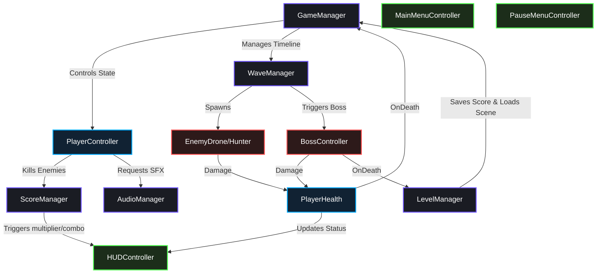

# 🌌 Galaxy Defender

🇻🇳 *Dự án Game bắn súng không gian 2D Retro Arcade được phát triển bằng Unity 2022.3 LTS. Tài liệu này cung cấp hướng dẫn cài đặt, kiến trúc hệ thống và hướng dẫn cộng tác nhóm.*

---

[](https://unity.com/)
[](https://microsoft.com/)
[](https://github.com/)
[](LICENSE)

Galaxy Defender is a 2D pixel-art arcade space shooter for PC. As the commander of a high-tech starship, your mission is to navigate through hazardous space sectors, fight off progressive waves of alien invaders, and destroy the ultimate boss threatening Earth.

---

## 🎮 Game Controls

| Key | Action | Details |
| :--- | :--- | :--- |
| `W` / `A` / `S` / `D` or `Arrow Keys` | **Movement** | Move the spaceship in 8 directions, clamped within screen bounds. |
| `Left Shift` | **Tactical Dash** | 3× speed burst for `0.15s`. Grants invincibility frames (i-frames). Cooldown: `2s`. |
| `Spacebar` (Hold) | **Primary Fire** | Fires laser beams at a constant rate of 1 bullet per `0.15s`. |
| `Escape` | **Pause Menu** | Open/close the pause screen, freeze game state and time scale. |

---

## 🌟 Key Technical Features

### 1. Object Pooling System
To guarantee a stable **60 FPS** on lower-end systems, Galaxy Defender implements a generic object pool (`ObjectPool.cs`) for:
* **Projectiles** (Player bullets, Enemy bullets, Boss energy spheres)
* **Visual Effects** (Explosion animations, particle hits)
This avoids frequent runtime `Instantiate` / `Destroy` calls, reducing Garbage Collection (GC) spikes to **0 bytes** during active gameplay.

### 2. Interactive Tilemaps & Obstacles
Each level features a custom multi-layer grid:
* `Tilemap_BG` & `Tilemap_Decor`: Parallax-scrolling space backdrops.
* `Tilemap_Collision`: Rigid boundaries painted with custom sci-fi tiles, preventing corner-sliding or wall clipping.
* `Tilemap_Hazard`: Dangerous zones dealing progressive damage over time.
* `StationBrickObject` & `TilemapInteractive`: Destructible bricks, triggerable gates, and oscillating platforms.

### 3. Dynamic Environment & Weather
An automated, context-aware environment system changes weather conditions (Cosmic Mist, Solar Flares, Comet Storms) as levels progress. Weather states adjust particle density, visual color filters, and difficulty coefficients dynamically.

### 4. Boss Phase State Machine
The level 3 boss has 3 distinct health-threshold-based attack modes:
* **Phase 1 (100% - 66% HP)**: Stationary position firing single straight lasers.
* **Phase 2 (66% - 33% HP)**: Moves in a horizontal sine wave and fires high-rate straight barrages.
* **Phase 3 (33% - 0% HP)**: High-speed sine movement, fires 3-bullet spread shots (±15°), and spawns helper Drones once.

### 5. Spaceship Showroom
An interactive menu system allowing players to preview different space vehicles, review ship arsenals, and read structural and tactical stats before launching into battle.

---

## 🏗️ Architecture & Class Relations

Below is a flowchart highlighting how the core game loops, scene managers, player controllers, and HUD events interact during gameplay:



---

## 📂 Project Structure

The project is structured according to standardized Unity layout conventions:

```
Assets/
├── Animations/         # Animator Controllers & sprite animations (thrusters, explosions)
├── Audio/              # Sound assets
│   ├── BGM/            # Loopable .ogg music tracks (Streamed)
│   └── SFX/            # Impact, dash, laser, explosion .wav audio (Preloaded)
├── Fonts/              # PressStart2P TTF & TMPro Font Assets
├── Prefabs/            # Pre-configured GameObjects (Player, Drone, Hunter, Boss, Powerups)
├── Resources/          # TileSetData assets loaded dynamically at runtime
├── Scenes/             # Scene files (MainMenu, Levels 1-3, GameOver)
├── Scripts/            # C# scripts organized by role:
│   ├── Player/         # PlayerController, PlayerHealth
│   ├── Enemy/          # BossController, EnemyDrone, EnemyHunter, ObstacleMine
│   ├── Managers/       # WaveManager, GameManager, LevelManager, AudioManager, SaveManager
│   ├── Systems/        # ObjectPool, ParallaxBackground, RuntimeSpriteFixer, Tilemap scripts
│   └── UI/             # HUDController, HighScoreController, MainMenuController, OptionsController
└── Sprites/            # 2D Sprite Sheets sliced on a 16x16 / 32x32 pixel grid
```

---

## 🛠️ Installation & Setup Guide

To load and modify this project in the Unity Editor:

### Prerequisites
* **Unity Hub** installed.
* **Unity 2022.3 LTS** (64-bit editor) installed.

### Loading the Project
1. Open **Unity Hub**.
2. Click **Add** -> **Add project from disk**.
3. Choose the root folder `PRU213_Project_Su26Semester_GalaxyDefender`.
4. Open the project and wait for Unity to import all assets.

### Building the Game (.exe)
1. Go to **File** -> **Build Settings...**
2. Ensure the platform is set to **PC, Mac & Linux Standalone**, and target architecture is **Windows x86-64**.
3. Ensure the scene load order matches:
   1. `MainMenu.unity`
   2. `Level1.unity`
   3. `Level2.unity`
   4. `Level3_Boss.unity`
   5. `GameOver.unity`
4. Click **Build**, select your output directory (e.g., `Build/`), and launch `GalaxyDefender.exe`.

---

## 👥 Development & Collaboration rules

To prevent **Merge Conflicts** and keep the codebase operational at all times, the team strictly follows these developer principles:

* **Single-Scene Ownership**: Do not edit scene files (`.unity`) simultaneously with other members. Work on localized **Prefabs** instead.
* **Meta Files Consistency**: Always commit `.meta` files together with newly imported C# files, sprites, or audio clips. 
* **Branch Strategy**: Developers work on short-lived feature branches using the naming schema `[role]/[feature-name]` (e.g. `p1/player-dash`). Merges directly target the `main` branch, which must remain build-stable at all times.

---

## 🏆 Development Team & Work Split

| Member | Role | Key Contributions |
| :--- | :--- | :--- |
| **P1** | Lead Core Developer | Player controls, movement bounds, dash coroutines, enemy AI movement, bullet behaviors. |
| **P2** | Systems Developer | Wave spawning algorithms, audio controls (crossfades), scoring logic, local saving system. |
| **P3** | UI & Level Designer | HUD controls, Menu layouts, Tilemap paint grids, Parallax loops, sprite sheet animations. |
| **P4** | Asset & QA Manager | Art/Audio resource sourcing, post-processing alpha channels, playtest checks, build packaging. |

---
*Created as part of the PRU213 Course Project.*
