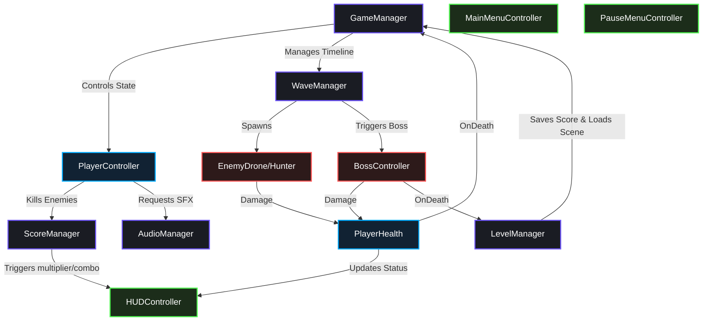

# 🌌 Galaxy Defender

🇻🇳 *Dự án Game bắn súng không gian 2D Retro Arcade hoàn chỉnh được thiết kế và phát triển bằng Unity 2022.3 LTS. Tài liệu này mô tả chi tiết từ cơ chế gameplay, thông tin tàu/quái, kiến trúc phần mềm, thông số kỹ thuật đến hướng dẫn build game và quy trình làm việc nhóm.*

---

[](https://unity.com/)
[](https://microsoft.com/)
[](https://github.com/)
[](https://drive.google.com/drive/folders/YOUR_GOOGLE_DRIVE_BUILD_LINK_HERE)

> **📥 Tải game trực tiếp từ Google Drive tại đây:** [**Google Drive Build Link**](https://drive.google.com/drive/folders/YOUR_GOOGLE_DRIVE_BUILD_LINK_HERE)

---

## 📖 Table of Contents
1. [🎮 Game Controls](#-game-controls)
2. [🛸 Ships of the Fleet (Tàu Ta)](#-ships-of-the-fleet-tàu-ta)
3. [👾 Enemy Bestiary & Hazards (Quái Vật & Cạm Bẫy)](#-enemy-bestiary--hazards-quái-vật--cạm-bẫy)
4. [🌟 Core Gameplay Systems](#-core-gameplay-systems)
5. [🧬 Software Architecture & Design Patterns](#-software-architecture--design-patterns)
6. [📂 Project Directory Mapping](#-project-directory-mapping)
7. [📜 Comprehensive Script Catalogue](#-comprehensive-script-catalogue)
8. [⚙️ Technical Specifications & Balancing](#️-technical-specifications--balancing)
9. [🛠️ Installation, Setup & Build Guide](#️-installation-setup--build-guide)
10. [👥 Team Collaboration & Git Guidelines](#-team-collaboration--git-guidelines)

---

## 🎮 Game Controls

| Key / Input | Action | Technical Realization |
| :--- | :--- | :--- |
| `W` / `A` / `S` / `D` or `Arrow Keys` | **8-Way Movement** | Applied via `Rigidbody2D.MovePosition` in `FixedUpdate` (normalized to prevent diagonal speed boosts). |
| `Left Shift` | **Tactical Dash** | 3× speed burst for `0.15s`. Grants invincibility frames (i-frames) and shields the player from damage. Cooldown: `1.5s`. |
| `Spacebar` (Hold) | **Primary Weapon Fire** | Spawns bullets from nose tip at a rate of 1 bullet per `0.05s` (using Object Pooling). |
| `Escape` | **Pause / Resume** | Freezes the game scale (`Time.timeScale = 0`), opening the Pause menu interface. |

---

## 🛸 Ships of the Fleet (Tàu Ta)

On start, the player ship randomly selects one of 5 unique ship configurations (`ShipConfig`), altering its sprite, firing visuals, and bullet styles:

| Ship Name | Design Aesthetic | Bullet Type & Aesthetic | Fire Rate / Upgrades |
| :--- | :--- | :--- | :--- |
| **Default** | Classic blue sleek triangular spaceship, featuring a soft blue engine thruster glow at the rear. | `bullet_player.png`<br>Small neon blue laser capsule. | Base rate `0.05s`. Multiplying upgrades to 3, 9, or 27 bullets. |
| **Iron Vanguard** | Heavily armored battle cruiser with a robust grey structure and reinforced side panels. | `player_iron_vanguard_bullet.png`<br>High-caliber heavy copper projectiles. | Triggers high camera shake scale (`0.12f` at tier 3) due to heavy payload. |
| **Nova Prism** | Sleek white futuristic ship lined with crystal prisms that capture and focus star light. | `player_nova_prism_bullet.png`<br>Glowing, multi-colored neon energy beams. | Vibrant trail effect matching the cycling hue of the energy lasers. |
| **Shadow Wraith** | Stealth-focused recon fighter with dark-matter panels and glowing purple exhausts. | `player_shadow_wraith_bullet.png`<br>Dark purple plasma orbs with fading trails. | Darker visual aesthetics. Ideal for stealth operations. |
| **Star Swift** | Aerodynamic interceptor featuring sweep-wing designs engineered for raw speed. | `player_star_swift_bullet.png`<br>Long yellow high-velocity plasma spears. | Thruster glow stretches larger (`1.65x`) when executing upward movements. |

---

## 👾 Enemy Bestiary & Hazards (Quái Vật & Cạm Bẫy)

### 1. Alien Forces (Quái Vật)

| Enemy Type | Visual Representation | HP | Movement Speed | Firing Attack Pattern | Score | Power-up Drop |
| :--- | :--- | :---: | :---: | :--- | :---: | :---: |
| **Drone** | `enemy_drone.png`<br>Small red angular reconnaissance drone. | `20` | `2.0 units/s`<br>Moves straight down. | Fires a single straight red laser downward every `2.0s`. | `100` | `30%` |
| **Hunter** | `enemy_hunter.png`<br>Orange wide-wing aggressive interceptor. | `40` | `3.5 units/s`<br>Tracks player's X-axis; moves down at `1.0 u/s`. | Fires target lasers downward every `1.5s`. Automatically aligns with player's X. | `200` | `30%` |
| **Boss (Phase 1)** | `enemy_boss.png`<br>Large purple symmetrical battleship with central energy core. | `300`<br>(Total) | `1.0 unit/s`<br>Decends to top-center. | Stationary. Fires single heavy purple energy spheres every `1.0s`. | — | — |
| **Boss (Phase 2)** | `enemy_boss_phase2.png`<br>Battle-damaged hull showing electrical sparks. | `200` | `1.5 units/s`<br>Drifts in horizontal sine wave. | Fires a high-rate straight bullet barrage every `0.7s`. | — | — |
| **Boss (Phase 3)** | `enemy_boss_phase3.png`<br>Critically damaged core glowing red with breaking parts. | `100` | `2.0 units/s`<br>Rapid horizontal sine waves. | Fires a 3-bullet spread shot (±15° angles) every `0.4s`. Spawns 2 Drone guards once. | `1000` | — |

### 2. Environmental Hazards (Chướng Ngại Vật)

* **Obstacle Mine (Space Mine)**:
  * **HP**: Indestructible (bullets pass through as it lacks `EnemyHealth`).
  * **Contact Damage**: Deals `50,000` HP damage on collision.
  * **Behavior**: Drifts straight down at `1.5 units/s`. When it hits the player, it triggers an explosion (`ExplosionSmallPool` + `ExplosionLargePool`), shakes the camera (`0.2f`), and plays `sfx_explosion_small` before returning to the pool. It does not block wave progression and awards no points.
* **Dynamic Station Bricks**:
  * **Helper Bricks (Green)**: Restore `50,000 HP` and `50,000 Shield` on collision. Fleshes green and plays `sfx_powerup_shield`.
  * **Hazard Bricks (Red)**: Deal `20,000 HP` damage on contact. Plays `sfx_player_hit`.
  * *Blinking Warning*: When bricks reach the last 2 seconds of their 6-second lifespan, they blink rapidly before expiring.

---

## 🌟 Core Gameplay Systems

### 1. Object Pooling System
To guarantee a stable **60 FPS** on lower-end systems, Galaxy Defender implements a generic object pool (`ObjectPool.cs`) for:
* **Projectiles** (Player bullets, Enemy bullets, Boss energy spheres)
* **Visual Effects** (Explosion animations, particle hits)
This avoids frequent runtime `Instantiate` / `Destroy` calls, reducing Garbage Collection (GC) spikes to **0 bytes** during active gameplay.

### 2. Interactive Tilemaps & Obstacles
Each level features a custom multi-layer grid:
* `Tilemap_BG` & `Tilemap_Decor`: Parallax-scrolling space backdrops.
* `Tilemap_Collision`: Rigid boundaries painted with custom sci-fi tiles, preventing corner-sliding or wall clipping.
* `Tilemap_Hazard`: Dangerous zones dealing progressive damage over time.
* `StationBrickObject` & `TilemapInteractive`: Destructible bricks, triggerable gates, and oscillating platforms.

### 3. Dynamic Environment & Weather
An automated, context-aware environment system changes weather conditions (Cosmic Mist, Solar Flares, Comet Storms) as levels progress:
* **Level 1 (Earth Orbit)**: Gentle Cosmic Dust storm (Cyan/White shimmering dust particles drifting with minor wind).
* **Level 2 (Asteroid Field)**: Solar Wind & Radiation Flares (Amber/Orange sparks with horizontal sine wobbles). Triggers periodic screen-space orange radiation pulses.
* **Level 3 (Deep Space)**: Hypernova Comet Storm (Neon teal comet trails traveling at 3.5× speed with strong diagonal winds).
* *Performance Optimization*: All weather particles are generated **procedurally at runtime** by building a soft-gradient glow texture dynamically via `CreateGlowSprite()`, preventing texture asset load times.

### 4. Physics-Based Health & Death Mechanics
* **HP and Shield Values**: The player features a high-fidelity pool of `1,000,000 Max HP` and `1,000,000 Max Shield`. The shield acts as a buffer, absorbing incoming damage first.
* **Knockback Nudge**: Taking damage triggers a physical knockback direction away from the impact point, executed via a kinematic Rigidbody2D coroutine over `0.1s`.
* **Slow-Motion Respawn**: When a life is lost, the game enters a dramatic slow-motion sequence (`Time.timeScale = 0.3f`) for `0.8s` before respawning the ship at the bottom center.

### 5. Spaceship Showroom
An interactive menu system allowing players to preview different space vehicles, review ship arsenals, and read structural and tactical stats before launching into battle.

---

## 🧬 Software Architecture & Design Patterns

The codebase is built on SOLID principles to keep systems highly decoupled:

* **Singleton Pattern**: Core controllers (`GameManager`, `WaveManager`, `ScoreManager`, `LevelManager`, `AudioManager`) utilize the Singleton pattern, ensuring centralized access points.
* **Object Pooling**: Managed through `ObjectPool.cs`, bullets and impact effects are cached inside containers on Awake. If the max capacity is reached, the pool automatically recycles the oldest active bullet.
* **ScriptableObject Configurations**: Level wave lists and enemy stats are serialized using ScriptableObjects (`WaveData`), making wave patterns easily editable in the Inspector.
* **Event-Driven UI**: HighScore and HUD elements are updated instantly through `UnityEvents` (`OnHPChanged`, `OnShieldChanged`, `OnScoreChanged`), avoiding expensive `Update()` calls.

### Architectural Interaction Diagram



---

## 📂 Project Directory Mapping

```
Assets/
├── Animations/             # Contains clips, sprite sheet frames, and Animator Controllers
├── Audio/                  # Holds background tracks and event-triggered SFX files
│   ├── BGM/                # Loopable chiptune tracks (Streaming load)
│   └── SFX/                # Collision, shoot, and UI sounds (Decompress on Load)
├── Fonts/                  # TextMeshPro fonts (PressStart2P) and SDF assets
├── Prefabs/                # Instantiated game templates (Player, Drone, Hunter, Boss)
├── Resources/              # Dynamic asset files (TileSetData, PanelSettings)
├── Scenes/                 # The main executable scenes (MainMenu, Levels, GameOver)
├── Scripts/                # C# Scripts organized by gameplay responsibilities
│   ├── Player/             # Player controller inputs and health states
│   ├── Enemy/              # Enemy behavior scripts, boss controllers, and obstacles
│   ├── Managers/           # Singletons overseeing global states, waves, and audio
│   ├── Systems/            # Core physics, object pools, weather, and tile loaders
│   └── UI/                 # HUD layout controllers and menu animations
├── Settings/               # URP settings and configuration scripts
├── Sprites/                # Sprite assets sliced to Point-filtered grid sheets
└── TilePalettes/           # Sliced tile palettes for painting scene grids
```

---

## 📜 Comprehensive Script Catalogue

Below is a complete description of the scripts driving the systems:

### 🛸 Player Components
* [PlayerController.cs](file:///d:/Coder-Program/Code_Unity%20Game/PRU213_Project_Su26Semester_GalaxyDefender/Assets/Scripts/Player/PlayerController.cs) - Manages 8-way movement input, boundaries, weapon tiers, screen space clamps, and thruster flickers.
* [PlayerHealth.cs](file:///d:/Coder-Program/Code_Unity%20Game/PRU213_Project_Su26Semester_GalaxyDefender/Assets/Scripts/Player/PlayerHealth.cs) - Tracks HP/Shield values, damage absorption, knockbacks, and the slow-motion respawn routine.

### 👾 Enemy & Obstacle Behaviors
* [BossController.cs](file:///d:/Coder-Program/Code_Unity%20Game/PRU213_Project_Su26Semester_GalaxyDefender/Assets/Scripts/Enemy/BossController.cs) - Implements the Level 3 boss's 3 phases, pathing, and spread shoot styles.
* [EnemyDrone.cs](file:///d:/Coder-Program/Code_Unity%20Game/PRU213_Project_Su26Semester_GalaxyDefender/Assets/Scripts/Enemy/EnemyDrone.cs) - Drives Level 1 drone behaviors (vertical descent and firing intervals).
* [EnemyHunter.cs](file:///d:/Coder-Program/Code_Unity%20Game/PRU213_Project_Su26Semester_GalaxyDefender/Assets/Scripts/Enemy/EnemyHunter.cs) - Drives Level 2 hunter behaviors (X-axis player tracking and target fire).
* [EnemyHealth.cs](file:///d:/Coder-Program/Code_Unity%20Game/PRU213_Project_Su26Semester_GalaxyDefender/Assets/Scripts/Enemy/EnemyHealth.cs) - Monitors health, damage flashes, scoring triggers, and power-up drop drops.
* [ObstacleMine.cs](file:///d:/Coder-Program/Code_Unity%20Game/PRU213_Project_Su26Semester_GalaxyDefender/Assets/Scripts/Enemy/ObstacleMine.cs) - Handles passive space mines that explode on proximity or bullet contact.

### 💼 Manager Singletons
* [GameManager.cs](file:///d:/Coder-Program/Code_Unity%20Game/PRU213_Project_Su26Semester_GalaxyDefender/Assets/Scripts/Managers/GameManager.cs) - Governs the central Finite State Machine ( FSM ) (Playing, Paused, GameOver, Victory).
* [WaveManager.cs](file:///d:/Coder-Program/Code_Unity%20Game/PRU213_Project_Su26Semester_GalaxyDefender/Assets/Scripts/Managers/WaveManager.cs) - Polls active enemy counts, handles spawn positions, and transitions waves.
* [LevelManager.cs](file:///d:/Coder-Program/Code_Unity%20Game/PRU213_Project_Su26Semester_GalaxyDefender/Assets/Scripts/Managers/LevelManager.cs) - Directs scene transitions and triggers Victory conditions.
* [AudioManager.cs](file:///d:/Coder-Program/Code_Unity%20Game/PRU213_Project_Su26Semester_GalaxyDefender/Assets/Scripts/Managers/AudioManager.cs) - Controls background tracks (with crossfades) and triggers event-based SFX.
* [SaveManager.cs](file:///d:/Coder-Program/Code_Unity%20Game/PRU213_Project_Su26Semester_GalaxyDefender/Assets/Scripts/Managers/SaveManager.cs) - Saves and loads player score records and graphics/volume preferences using `PlayerPrefs`.
* [ScoreManager.cs](file:///d:/Coder-Program/Code_Unity%20Game/PRU213_Project_Su26Semester_GalaxyDefender/Assets/Scripts/Managers/ScoreManager.cs) - Tracks score, combos, and multipliers.

### ⚙️ Core Systems
* [ObjectPool.cs](file:///d:/Coder-Program/Code_Unity%20Game/PRU213_Project_Su26Semester_GalaxyDefender/Assets/Scripts/Systems/ObjectPool.cs) - Recycles project projectiles and particles to maintain 0 GC allocation.
* [SpaceWeatherController.cs](file:///d:/Coder-Program/Code_Unity%20Game/PRU213_Project_Su26Semester_GalaxyDefender/Assets/Scripts/Systems/SpaceWeatherController.cs) - Generates procedural glow sprites and handles level weather particles.
* [LevelTilemapSpawner.cs](file:///d:/Coder-Program/Code_Unity%20Game/PRU213_Project_Su26Semester_GalaxyDefender/Assets/Scripts/Systems/LevelTilemapSpawner.cs) - Spawns vertical tilemap layers, parallax loops, and dynamic station walls.
* [StationBrickObject.cs](file:///d:/Coder-Program/Code_Unity%20Game/PRU213_Project_Su26Semester_GalaxyDefender/Assets/Scripts/Systems/StationBrickObject.cs) - Controls temporary station wall bricks (blinking warning, layer check, and damage/heal effects).
* [RuntimeSpriteFixer.cs](file:///d:/Coder-Program/Code_Unity%20Game/PRU213_Project_Su26Semester_GalaxyDefender/Assets/Scripts/Systems/RuntimeSpriteFixer.cs) - Standardizes import and rendering settings of newly imported pixel sprites.

### 🖥️ User Interface Controllers
* [HUDController.cs](file:///d:/Coder-Program/Code_Unity%20Game/PRU213_Project_Su26Semester_GalaxyDefender/Assets/Scripts/UI/HUDController.cs) - Displays real-time HP/Shield sliders, scores, and active multiplier values.
* [BossHUDController.cs](file:///d:/Coder-Program/Code_Unity%20Game/PRU213_Project_Su26Semester_GalaxyDefender/Assets/Scripts/UI/BossHUDController.cs) - Controls Warning banners and the boss health bar.
* [MainMenuController.cs](file:///d:/Coder-Program/Code_Unity%20Game/PRU213_Project_Su26Semester_GalaxyDefender/Assets/Scripts/UI/MainMenuController.cs) - Handles menu button interactions and reads score history profiles.
* [OptionsController.cs](file:///d:/Coder-Program/Code_Unity%20Game/PRU213_Project_Su26Semester_GalaxyDefender/Assets/Scripts/UI/OptionsController.cs) - Links UI sliders to Unity `AudioMixer` Decibel levels.

---

## ⚙️ Technical Specifications & Balancing

### Score Combo Increments
* **Drone Destroyed**: `+100 Points`
* **Hunter Destroyed**: `+200 Points`
* **Boss Defeated**: `+1000 Points`
* **Power-up collected**: `+50 Points`
* **Streak Multipliers**: 
  * `5 Kills` without taking damage ➔ **Combo x2** score multiplier.
  * `10 Kills` without taking damage ➔ **Combo x3** score multiplier.
  * *Note*: Taking damage resets the combo counter to 0.

---

## 🛠️ Installation, Setup & Build Guide

### Editor Loading
1. Open **Unity Hub** and click **Add** ➔ **Add project from disk**.
2. Select the `PRU213_Project_Su26Semester_GalaxyDefender` folder.
3. Open the project using **Unity 2022.3 LTS**.
4. Once loaded, open [MainMenu.unity](file:///d:/Coder-Program/Code_Unity%20Game/PRU213_Project_Su26Semester_GalaxyDefender/Assets/Scenes/MainMenu.unity) to test run from the editor.

### Scene Hierarchy Ordering
To build the game successfully, ensure the build order under **File ➔ Build Settings...** is configured as:
1. `MainMenu.unity` (Index 0)
2. `Level1.unity` (Index 1)
3. `Level2.unity` (Index 2)
4. `Level3_Boss.unity` (Index 3)
5. `GameOver.unity` (Index 4)

### Building Executable
* **Target OS**: Windows (64-bit)
* **API Compatibility Level**: .NET Standard 2.1
* Click **Build**, create an output folder (e.g. `Builds/`), and open `GalaxyDefender.exe`.

---

## 👥 Team Collaboration & Git Guidelines

To maintain code integrity and avoid Unity YAML conflicts, follow these 3 golden rules:

1. **Lock Scenes (Rule 1)**: Do not edit scene files (`.unity`) simultaneously. Work on localized **Prefabs** (`.prefab`) instead, and let scenes auto-update.
2. **Commit Meta Files (Rule 2)**: Every script or sprite asset has a matching `.meta` GUID file. Never ignore or split meta file commits, otherwise game linkages will break (producing pink missing textures).
3. **Branching Protocol**:
   * Branch Schema: `[role]/[feature-name]` (e.g., `p1/player-movement`, `p3/hud-canvas`).
   * Merge flow: Pull latest `main` ➔ Build feature ➔ Push branch ➔ Open PR ➔ Merge.

---
*Created as part of the PRU213 Course Project.*
